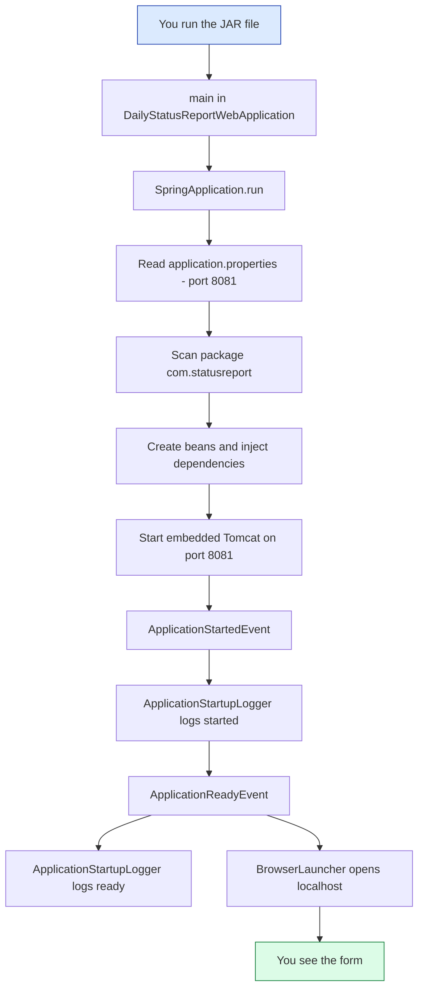
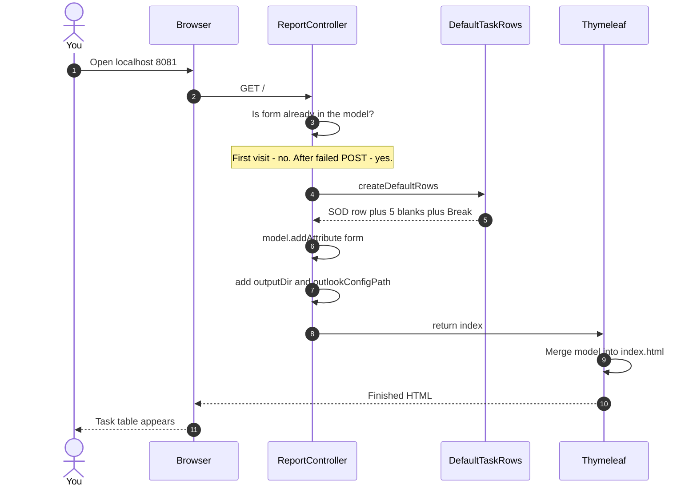
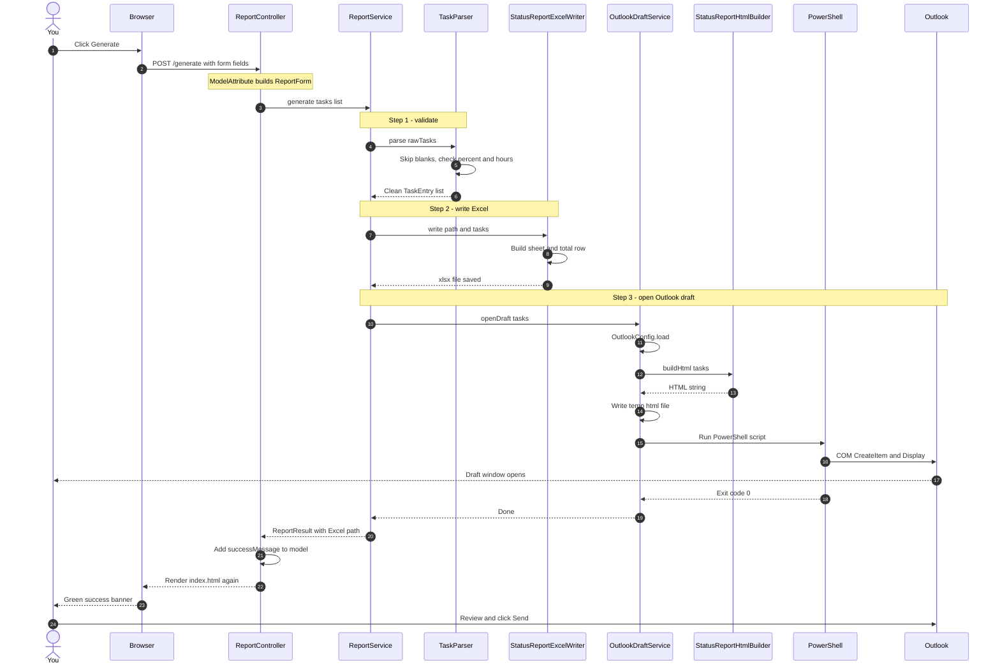
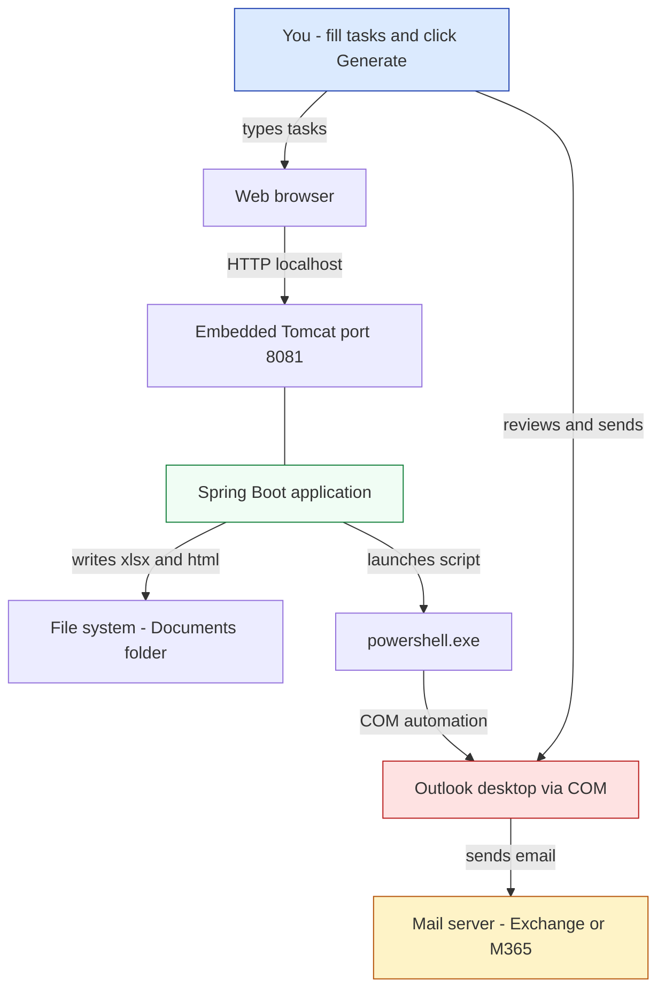
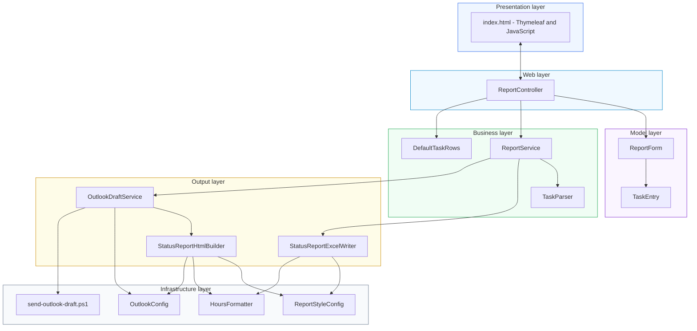
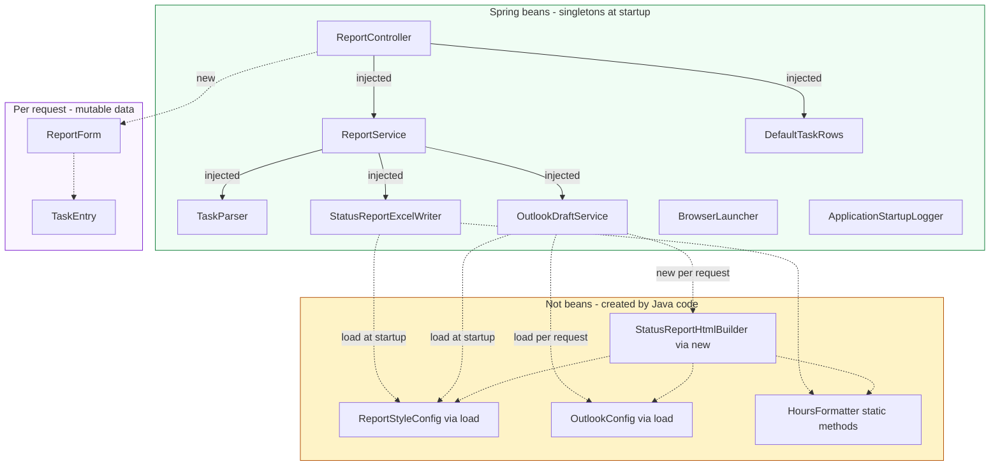
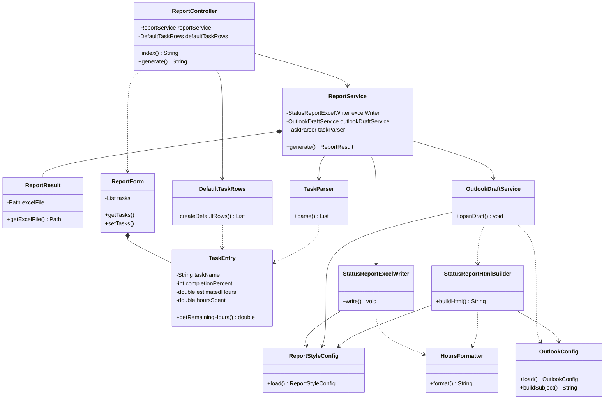
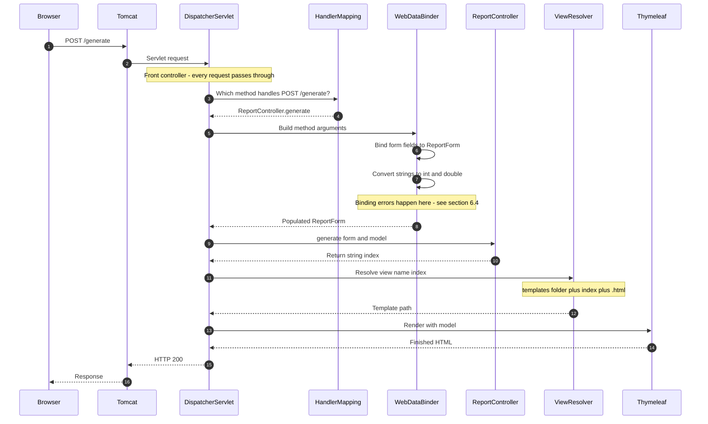
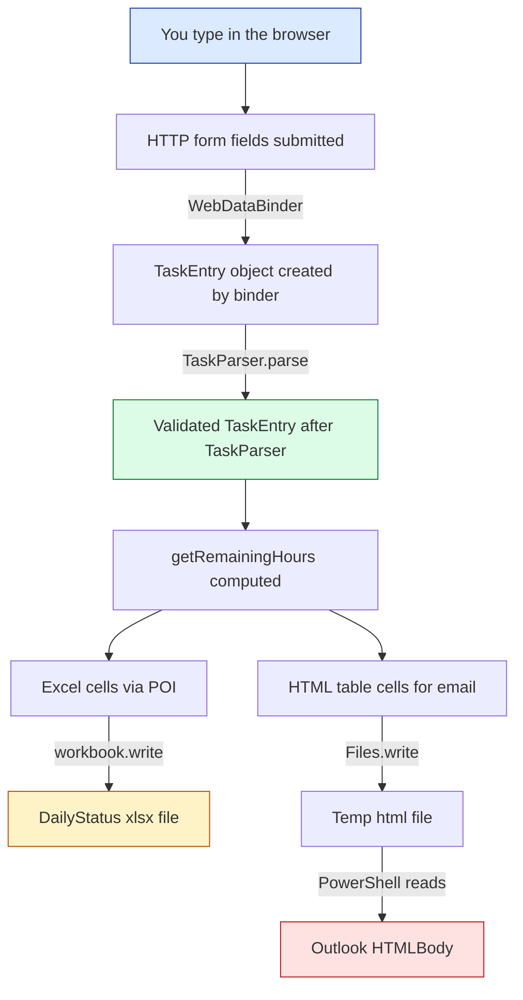
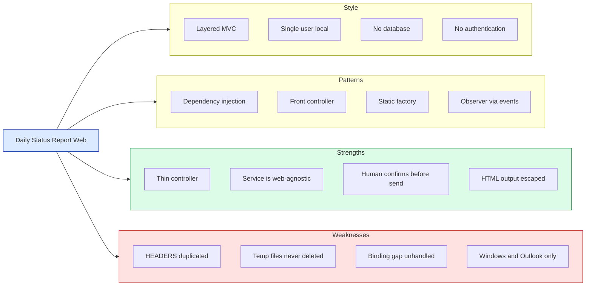

# Daily Status Report Web — Complete Beginner's Guide

**Audience:** Someone new to Java / Spring Boot
**Goal:** Understand every file, every class, every annotation, and the exact order in which things happen.

---

## Table of Contents

1. [What this app does](#1-what-this-app-does)
2. [Technology stack](#2-technology-stack)
3. [Folder structure](#3-folder-structure)
4. [Spring Boot basics you need first](#4-spring-boot-basics-you-need-first)
5. [The big picture flow](#5-the-big-picture-flow)
6. [Classes explained in sequence](#6-classes-explained-in-sequence)
7. [Configuration files](#7-configuration-files)
8. [The web page (index.html)](#8-the-web-page-indexhtml)
9. [The PowerShell script](#9-the-powershell-script)
10. [Annotation cheat sheet](#10-annotation-cheat-sheet)
11. [How to run it](#11-how-to-run-it)
12. [Troubleshooting](#12-troubleshooting)
13. [Class execution order (one-page summary)](#13-class-execution-order-one-page-summary)
14. [Complete architecture (Mermaid diagrams)](#14-complete-architecture-mermaid-diagrams)
15. [Senior developer interview preparation](#15-senior-developer-interview-preparation)

> **Already know Java?** Jump straight to [section 14](#14-complete-architecture-mermaid-diagrams)
> for the full architecture, then [section 15](#15-senior-developer-interview-preparation) for the
> design trade-offs.
>
> **About the diagrams.** Mermaid code blocks in this file often show as **blank boxes** in
> Cursor's built-in preview. That is a Cursor limitation, not a problem with this guide.
>
> **To see colorful diagrams, use one of these:**
>
> | Method | Action |
> |---|---|
> | **Easiest** | Double-click `docs/architecture-viewer.html` or run `OpenArchitectureDiagrams.bat` |
> | **GitHub** | Push the repo and open this file on github.com |
> | **Standard preview** | `Ctrl+Shift+V` with **Markdown Preview Mermaid Support** (Matt Bierner) — may work, may not in Cursor |
>
> See `docs/architecture.md` for a short explanation of why Cursor preview stays blank.

---

## 1. What this app does

This is a **local web application**. It runs on your own PC, not on a server. Every day you use it to
report what work you did.

```
You start the app
       |
       v
Browser opens automatically
       |
       v
You type your tasks in a table
       |
       v
You click "Generate"
       |
       v
App creates an Excel file  +  App opens an Outlook draft email
       |
       v
You click "Send" in Outlook
```

**Where files are saved:** `C:\Users\<you>\Documents\DailyStatusReports\`

There is **no database** and **no login**. Everything is local.

---

## 2. Technology stack

| Technology | Version | What it does here |
|---|---        |---|
| Java          | 17    | The programming language |
| Spring Boot   | 3.4.5  | The framework — starts the server, creates and connects objects |
| Maven         | wrapper (`mvnw.cmd`) | Downloads libraries and builds the JAR file |
| Thymeleaf     | via starter | Turns `index.html` into a real page filled with Java data |
| Apache POI    | 5.2.5 | Creates the `.xlsx` Excel file |
| Embedded Tomcat | via starter | The web server that lives *inside* the JAR |
| PowerShell + Outlook COM | — | Opens the Outlook draft (Windows only) |

All of this is declared in `pom.xml`.

---

## 3. Folder structure

```
daily-status-report-web/
|
|-- pom.xml                  <- libraries + build settings
|-- WebDailyStatus.bat       <- double-click to build and run
|-- mvnw.cmd                 <- Maven wrapper (no global Maven needed)
|
|-- src/main/java/com/statusreport/
|     |
|     |-- DailyStatusReportWebApplication.java   <- START HERE (main method)
|     |
|     |-- BrowserLauncher.java                   <- opens browser at startup
|     |-- config/
|     |     |-- ApplicationStartupLogger.java    <- logs startup messages
|     |
|     |-- ReportController.java                  <- handles web requests
|     |
|     |-- ReportForm.java                        <- holds the whole form
|     |-- TaskEntry.java                         <- holds one task row
|     |
|     |-- DefaultTaskRows.java                   <- creates the starting rows
|     |-- TaskParser.java                        <- validates what you typed
|     |-- ReportService.java                     <- runs the whole workflow
|     |
|     |-- StatusReportExcelWriter.java           <- writes the .xlsx file
|     |-- StatusReportHtmlBuilder.java           <- builds the email HTML table
|     |-- OutlookDraftService.java               <- opens the Outlook draft
|     |
|     |-- OutlookConfig.java                     <- reads email settings
|     |-- ReportStyleConfig.java                 <- reads table colors
|     |-- HoursFormatter.java                    <- "1 hr." vs "2 hrs."
|
|-- src/main/resources/
|     |-- application.properties        <- port, logging, auto-open browser
|     |-- outlook-config.properties     <- To / CC / subject / signature
|     |-- report-style.properties       <- header colors (RGB)
|     |-- send-outlook-draft.ps1        <- PowerShell script for Outlook
|     |-- templates/
|           |-- index.html              <- the web page you see
|
|-- src/test/java/com/statusreport/
      |-- DailyStatusReportWebApplicationTests.java  <- "does the app start?" test
```

---

## 4. Spring Boot basics you need first

### 4.1 What is a "bean"?

A **bean** is just a Java object that **Spring creates and manages for you**.
You mark a class with an annotation, and Spring builds one instance at startup and keeps it.

```
@Component  ->  "Spring, please create this object"
@Service    ->  same thing, but signals "this holds business logic"
@Controller ->  same thing, but signals "this handles web requests"
```

All three do the same technical job. The different names exist so humans can read the code faster.

### 4.2 What is dependency injection?

You never write `new ReportService()`. Spring creates it and hands it to you through the constructor.

```java
// Spring sees this constructor and automatically supplies both objects
public ReportController(ReportService reportService, DefaultTaskRows defaultTaskRows) {
    this.reportService = reportService;
    this.defaultTaskRows = defaultTaskRows;
}
```

This is called **constructor injection**, and it is the recommended style.

### 4.3 The layers in this project

```
   BROWSER
      |
      |  HTTP request
      v
   CONTROLLER            ReportController
   (web layer)           "which URL was called?"
      |
      v
   SERVICE               ReportService
   (business layer)      "what steps must happen?"
      |
      +------------------+------------------+
      v                  v                  v
   TaskParser    StatusReportExcelWriter  OutlookDraftService
   (validate)    (write .xlsx)            (open email draft)
```

The controller stays **thin** (just HTTP in / HTTP out).
The service holds the **workflow**.
The small components each do **one job**.

---

## 5. The big picture flow

### Phase A — Startup

```
1. You run the JAR
        |
        v
2. main() in DailyStatusReportWebApplication
        |
        v
3. SpringApplication.run(...)
        |
        |-- reads application.properties   (port 8081)
        |-- scans package com.statusreport
        |-- creates all beans
        |-- injects dependencies
        |-- starts Tomcat on port 8081
        |
        v
4. ApplicationStartedEvent fires
        |-- ApplicationStartupLogger logs "Application started successfully"
        |
        v
5. ApplicationReadyEvent fires
        |-- ApplicationStartupLogger logs "Application is ready to accept requests"
        |-- BrowserLauncher opens http://localhost:8081/
```

Same thing as a rendered diagram:



Note that both listeners react to `ApplicationReadyEvent` independently. Neither knows the other
exists — that is the point of the event mechanism, and it is why the diagram branches at `J`.

### Phase B — The page loads (GET /)

```
Browser:  GET http://localhost:8081/
        |
        v
ReportController.index(Model model)
        |
        |-- DefaultTaskRows.createDefaultRows()
        |      -> row 1: "SOD: Performance Review"
        |      -> rows 2-6: empty
        |      -> row 7: "Break"
        |
        |-- model.addAttribute("form", form)
        |-- model.addAttribute("outputDir", ...)
        |-- model.addAttribute("outlookConfigPath", ...)
        |
        v
return "index"
        |
        v
Thymeleaf renders templates/index.html
        |
        v
You see the task table
```

Same thing as a rendered diagram:



### Phase C — You click Generate (POST /generate)

```
Browser:  POST /generate
          tasks[0].taskName=Fix login bug
          tasks[0].completionPercent=80
          tasks[0].estimatedHours=4
          ...
        |
        v
ReportController.generate(@ModelAttribute("form") ReportForm form, Model model)
        |
        v
ReportService.generate(form.getTasks())
        |
        |--- STEP 1 ---> TaskParser.parse(rawTasks)
        |                  - drop rows with no task name
        |                  - check % is 0..100
        |                  - check hours are not negative
        |                  - fill in defaults (remarks, date)
        |
        |--- STEP 2 ---> StatusReportExcelWriter.write(path, tasks)
        |                  - creates DailyStatus_2026-09-07.xlsx
        |
        |--- STEP 3 ---> OutlookDraftService.openDraft(tasks)
        |                  - OutlookConfig.load()
        |                  - StatusReportHtmlBuilder.buildHtml(tasks)
        |                  - write HTML to a temp file
        |                  - run send-outlook-draft.ps1
        |                  - Outlook shows the draft
        |
        v
returns ReportResult (holds the Excel path)
        |
        v
Controller adds successMessage + excelPath to the model
        |
        v
return "index"  ->  same page, now with a green success banner
```

Same thing as a rendered diagram. This is the most important diagram in the guide — it is the entire
purpose of the application in one picture:



Two things worth noticing in that diagram. First, `ReportService` is the only participant that talks
to all three steps — it owns the ordering, and nothing else in the app knows the sequence. Second,
the app **never** sends the email. The last arrow is you clicking Send, which is a deliberate design
decision covered in [section 14.7](#147-key-design-decisions-and-their-trade-offs).

### Phase D — If something goes wrong

```
TaskParser throws IllegalArgumentException
        -> "Row 3: Completion % must be between 0 and 100."

OutlookDraftService throws IllegalStateException
        -> "Recipient email is not configured. Edit: ...outlook-config.properties"

Excel or PowerShell throws IOException
        -> "Could not generate report. Make sure Outlook is installed and try again."

All three are caught in ReportController.generate()
        -> added to the model as errorMessage
        -> return "index"  ->  red error banner, your typed data is kept
```

---

## 6. Classes explained in sequence

Listed in the order they actually run.

---

### 6.1 `DailyStatusReportWebApplication.java`

**Role:** The entry point. The only class with a `main` method.

```java
@SpringBootApplication
public class DailyStatusReportWebApplication {
    public static void main(String[] args) {
        SpringApplication.run(DailyStatusReportWebApplication.class, args);
    }
}
```

| Item | Explanation |
|---|---|
| `@SpringBootApplication` | Three annotations in one: `@Configuration` (this class can define beans), `@EnableAutoConfiguration` (auto-set-up Tomcat, Thymeleaf, etc.), `@ComponentScan` (find all beans in this package and below) |
| `SpringApplication.run(...)` | Boots Spring, starts the web server, creates all beans |
| `main(String[] args)` | The standard Java starting point — the JVM calls this first |

**Important:** because this class sits in `com.statusreport`, Spring scans `com.statusreport` **and all
sub-packages** — which is why `com.statusreport.config.ApplicationStartupLogger` is also found.

---

### 6.2 `ApplicationStartupLogger.java`

**Package:** `com.statusreport.config`
**Role:** Writes a log line when the app starts and when it becomes ready.

```java
@Component
public class ApplicationStartupLogger {

    @EventListener
    public void onApplicationStarted(ApplicationStartedEvent event) { ... }

    @EventListener
    public void onApplicationReady(ApplicationReadyEvent event) { ... }
}
```

| Item | Explanation |
|---|---|
| `@Component` | Makes this a Spring bean so the listeners are registered |
| `@EventListener` | Spring calls this method when the event type in the parameter is published |
| `ApplicationStartedEvent` | Fired after the context is refreshed, before "ready" callbacks |
| `ApplicationReadyEvent` | Fired last — the app is fully up and can serve requests |
| `LoggerFactory.getLogger(...)` | SLF4J logger; output goes to `logs/app.log` (set in `application.properties`) |

**Why it matters:** it gives you a reliable "the app really started" marker in the log file.

---

### 6.3 `BrowserLauncher.java`

**Role:** Opens your default browser automatically once the app is ready.

```java
@Component
public class BrowserLauncher {

    @Value("${app.browser.auto-open:true}")
    private boolean autoOpen;

    @Value("${server.port:8081}")
    private int serverPort;

    @EventListener(ApplicationReadyEvent.class)
    public void openBrowser() { ... }
}
```

| Item | Explanation |
|---|---|
| `@Value("${key:default}")` | Injects a value from `application.properties`. The part after `:` is the fallback if the key is missing |
| `@EventListener(ApplicationReadyEvent.class)` | Only run **after** Tomcat is listening — otherwise the browser would hit a dead port |
| `Desktop.isDesktopSupported()` | Java AWT check; false on a headless machine |
| `desktop.browse(new URI(...))` | Asks the OS to open the URL |
| empty `catch (Exception ex)` | Opening the browser is a convenience, not a requirement — the app still works if you navigate manually |

**Switch it off:** set `app.browser.auto-open=false` in `application.properties`.

---

### 6.4 `ReportController.java`

**Role:** The web layer. Translates HTTP requests into method calls.

```java
@Controller
public class ReportController {
    private final ReportService reportService;
    private final DefaultTaskRows defaultTaskRows;

    public ReportController(ReportService reportService, DefaultTaskRows defaultTaskRows) { ... }
}
```

`@Controller` (not `@RestController`) means the return value is a **view name**, not JSON.
Returning `"index"` tells Thymeleaf to render `src/main/resources/templates/index.html`.

#### Method 1 — show the form

```java
@GetMapping("/")
public String index(Model model) {
    if (!model.containsAttribute("form")) {
        ReportForm form = new ReportForm();
        form.setTasks(defaultTaskRows.createDefaultRows());
        model.addAttribute("form", form);
    }
    model.addAttribute("outputDir", ReportService.OUTPUT_DIR.toString());
    model.addAttribute("outlookConfigPath", OutlookConfig.getUserConfigPath().toString());
    return "index";
}
```

| Item | Explanation |
|---|---|
| `@GetMapping("/")` | Handle `GET http://localhost:8081/` |
| `Model model` | A map of data handed to the template. `model.addAttribute("form", x)` makes `${form}` available in HTML |
| `containsAttribute("form")` guard | After a failed POST the submitted form is already in the model, so we must **not** overwrite it with fresh defaults |
| `return "index"` | View name -> `templates/index.html` |

#### Method 2 — handle the submit

```java
@PostMapping("/generate")
public String generate(@ModelAttribute("form") ReportForm form, Model model) {
    try {
        ReportService.ReportResult result = reportService.generate(form.getTasks());
        model.addAttribute("successMessage", "...");
        model.addAttribute("excelPath", result.getExcelFile().toString());
        model.addAttribute("form", form);
    } catch (IllegalArgumentException ex) { ... }
      catch (IllegalStateException ex)    { ... }
      catch (IOException ex)              { ... }
    ...
    return "index";
}
```

| Item | Explanation |
|---|---|
| `@PostMapping("/generate")` | Handle `POST /generate` (the form's `action`) |
| `@ModelAttribute("form")` | Spring builds a `ReportForm`, then fills it from the request parameters by name |

**How binding works:**

```
HTML input name:   tasks[0].taskName
                    |     |     |
                    |     |     +--> calls setTaskName(...) on the TaskEntry
                    |     +--------> index 0 of the list
                    +--------------> the getTasks() list on ReportForm
```

**Why three catch blocks:**

| Exception | Thrown by | Meaning for the user |
|---|---|---|
| `IllegalArgumentException` | `TaskParser` | Your input was invalid — message names the row |
| `IllegalStateException` | `OutlookDraftService` | `mail.to` is not filled in yet |
| `IOException` | Excel writer / PowerShell | Something on the machine failed; generic message shown |

Notice that every branch re-adds `form` to the model so **your typed data is not lost** on error.

#### The gap: binding happens *before* the method body

The three catch blocks are easy to misread as "every possible error is handled." They are not, and
the reason is a timing detail that catches out most people new to Spring MVC.

```
Request arrives
      |
      v
Spring converts the request parameters into a ReportForm     <-- STEP 1
      |                                                          your catch blocks
      |                                                          do NOT cover this
      v
Your generate() method body starts running                   <-- STEP 2
      |                                                          try/catch applies here
      v
Response
```

Step 1 is **data binding and type conversion**. It runs before a single line of your code executes,
so a `try/catch` inside the method cannot possibly see a failure there.

Now look at the field types being bound into:

```17:22:src/main/java/com/statusreport/TaskEntry.java
    private String taskName;
    private int completionPercent;
    private double estimatedHours;
    private double hoursSpent;
    private String remarks;
    private String completionDate;
```

`completionPercent` is a primitive `int`, and `estimatedHours` / `hoursSpent` are primitive `double`.
A primitive cannot hold `null`. If a numeric input arrives as an empty string — which is exactly what
an HTML `<input type="number">` submits when you clear it — the binder has nothing valid to convert
and records a field error.

Because `generate()` declares no `BindingResult` parameter after its `@ModelAttribute` parameter,
Spring's contract is to **throw** rather than hand you the errors. That surfaces as a `BindException`
and a generic 400 error page instead of the friendly red banner, and none of the three catch blocks
ever run.

> **Verify it in 30 seconds:** start the app, clear the "Est. Hours" box on any row so it is
> completely empty, and click Generate. A friendly red banner means the binder coped; a browser error
> page confirms the gap. Worth doing before you rely on this section.

The two idiomatic fixes:

| Fix | How | Trade-off |
|---|---|---|
| Add a `BindingResult` | `generate(@ModelAttribute("form") ReportForm form, BindingResult binding, Model model)` then check `binding.hasErrors()` first | Spring collects the errors instead of throwing. The parameter **must** come immediately after the `@ModelAttribute` one — order matters |
| Use wrapper types | Change the fields to `Integer` / `Double` | An empty input becomes `null` instead of a bind failure, but every read then needs a null check, and `TaskParser` would need updating |

Adding a `BindingResult` is the smaller change and the more conventional one. Either way this is a
genuine hole in the current error handling, not a style preference.

---

### 6.5 `ReportForm.java`

**Role:** The single object the HTML form binds to. A plain POJO — no annotations.

```java
public class ReportForm {
    private List<TaskEntry> tasks = new ArrayList<>();

    public List<TaskEntry> getTasks() { return tasks; }
    public void setTasks(List<TaskEntry> tasks) {
        this.tasks = tasks != null ? tasks : new ArrayList<>();
    }
}
```

| Item | Explanation |
|---|---|
| POJO | "Plain Old Java Object" — fields + getters + setters, nothing framework-specific |
| Why a wrapper class? | Spring needs **one** object to bind a whole form to. `th:object="${form}"` points at this |
| Null-safe setter | If the browser sends no rows at all, the list becomes empty instead of `null` |
| Getters/setters required | Spring's data binder uses them by reflection. Without them, binding silently fails |

---

### 6.6 `TaskEntry.java`

**Role:** One row of the report. Also a plain POJO.

| Field | Type | Meaning |
|---|---|---|
| `taskName` | `String` | What you worked on |
| `completionPercent` | `int` | 0 to 100 |
| `estimatedHours` | `double` | Planned effort |
| `hoursSpent` | `double` | Actual effort |
| `remarks` | `String` | e.g. "In Progress", "Complete" |
| `completionDate` | `String` | Text in `MM/dd/yyyy` form |

**One derived value — there is no field behind it:**

```java
public double getRemainingHours() {
    return Math.max(estimatedHours - hoursSpent, 0);
}
```

This is a **calculated getter**. It is computed every time it is read, and `Math.max(..., 0)` keeps it
from going negative when you spend more hours than estimated.

**This same class is reused in three places:**

```
TaskEntry
   |
   |--> ReportForm            (bound from the HTML form)
   |--> StatusReportExcelWriter (written into the .xlsx)
   |--> StatusReportHtmlBuilder (rendered into the email)
```

Reusing one model class is why the Excel and the email always show identical data.

---

### 6.7 `DefaultTaskRows.java`

**Role:** Builds the rows you see the first time the page loads.

```java
@Component
public class DefaultTaskRows {
    public static final String TASK_SOD   = "SOD: Performance Review";
    public static final String TASK_BREAK = "Break";

    public List<TaskEntry> createDefaultRows() { ... }
    public boolean isFixedTask(String taskName) { ... }
}
```

**The 7 starter rows:**

| # | Task name | % | Est. | Spent | Remarks |
|---|---|---|---|---|---|
| 1 | SOD: Performance Review | 100 | 0.5 | 0 | Complete |
| 2-6 | *(empty — you fill these)* | 0 | 0 | 0 | In Progress |
| 7 | Break | 100 | 1 | 1 | Complete |

| Item | Explanation |
|---|---|
| `@Component` | Makes it injectable into `ReportController` |
| `public static final String` | Constants — one source of truth for the fixed task names |
| `DateTimeFormatter.ofPattern("MM/dd/yyyy")` | Formats today's date the same way the UI expects |
| `isFixedTask(...)` | Says whether a row may be deleted. The same rule is duplicated in JavaScript so the browser can block it instantly |

The empty rows matter: `TaskParser` later **skips any row with a blank task name**, so unused rows
simply disappear from the report.

---

### 6.8 `TaskParser.java`

**Role:** The validation gate. Nothing reaches Excel or Outlook without passing here.

```java
@Component
public class TaskParser {
    public List<TaskEntry> parse(List<TaskEntry> rawTasks) { ... }
}
```

**The rules, in order:**

```
Is the list null or empty?
    -> throw IllegalArgumentException("Add at least one task with a task name.")

For each row:
    Is taskName blank after trim()?      -> skip this row silently
    Is completionPercent outside 0..100? -> throw "Row N: Completion % must be between 0 and 100."
    Are estimatedHours negative?         -> throw "Row N: Estimated Hours cannot be negative."
    Are hoursSpent negative?             -> throw "Row N: Spent Hours cannot be negative."
    Is remarks blank?                    -> use "In Progress"
    Is completionDate blank?             -> use today's date

Did every row get skipped?
    -> throw IllegalArgumentException("Add at least one task with a task name.")
```

| Item | Explanation |
|---|---|
| Returns a **new** list | The original form objects are never modified — safer and easier to reason about |
| `row + 1` in messages | Users count rows from 1, Java counts from 0 |
| `IllegalArgumentException` | Standard Java exception for "the caller gave me bad input". The controller catches it and shows the message directly |

**Design note:** notice the *skip* vs *throw* split. A blank row is normal (you left a default row
unused), so it is skipped. A negative number is a mistake, so it stops the whole operation.

---

### 6.9 `ReportService.java`

**Role:** The orchestrator. It knows the *order* of the three steps but not the *details* of any of them.

```java
@Service
public class ReportService {

    public static final Path OUTPUT_DIR = Paths.get(
            System.getProperty("user.home"), "Documents", "DailyStatusReports");

    public ReportService(StatusReportExcelWriter excelWriter,
                         OutlookDraftService outlookDraftService,
                         TaskParser taskParser) { ... }

    public ReportResult generate(List<TaskEntry> rawTasks) throws IOException {
        List<TaskEntry> tasks = taskParser.parse(rawTasks);

        String fileName = "DailyStatus_" + LocalDate.now() + ".xlsx";
        Path outputFile = OUTPUT_DIR.resolve(fileName);

        excelWriter.write(outputFile, tasks);
        outlookDraftService.openDraft(tasks);

        return new ReportResult(outputFile);
    }
}
```

| Item | Explanation |
|---|---|
| `@Service` | Business-logic bean |
| `System.getProperty("user.home")` | Resolves to `C:\Users\<you>` — works for every user without hardcoding a path |
| `Paths.get(a, b, c)` | Builds a path with the right separator for the OS |
| `OUTPUT_DIR.resolve(fileName)` | Appends the filename to the folder path |
| `LocalDate.now()` | Its `toString()` is ISO form, so the file is `DailyStatus_2026-09-07.xlsx` — sorts nicely by name |
| `throws IOException` | The service does not swallow I/O errors; the controller decides what the user sees |
| `ReportResult` (inner class) | A tiny read-only holder so the controller can display the saved path |

**The order is deliberate:** validate first (cheap, fails fast), then write the file, then open Outlook.
If validation fails, nothing is created at all.

Note that re-running on the same day **overwrites** the same file, because the name only contains the date.

---

### 6.10 `StatusReportExcelWriter.java`

**Role:** Turns the task list into a styled `.xlsx` file using Apache POI.

```java
@Component
public class StatusReportExcelWriter {
    public void write(Path outputFile, List<TaskEntry> tasks) throws IOException { ... }
}
```

#### An important exception to what section 4.2 taught

[Section 4.2](#42-what-is-dependency-injection) said Spring supplies constructor arguments. This
class is a deliberate exception, and it is worth understanding because the code looks like injection
but is not.

```50:56:src/main/java/com/statusreport/StatusReportExcelWriter.java
    public StatusReportExcelWriter() {
        this(ReportStyleConfig.load());
    }

    public StatusReportExcelWriter(ReportStyleConfig styleConfig) {
        this.styleConfig = styleConfig;
    }
```

There are **two** public constructors and neither carries `@Autowired`. Spring's rule for that
situation is:

| Situation | What Spring does |
|---|---|
| Exactly one constructor | Uses it and injects its arguments |
| Several constructors, one marked `@Autowired` | Uses the marked one |
| **Several constructors, none marked** | **Falls back to the no-arg constructor** |
| Several constructors, none marked, no no-arg constructor | Startup fails |

So Spring calls the **no-arg** constructor, which calls `ReportStyleConfig.load()` itself. The
`styleConfig` field is *not* injected.

It could not be injected anyway: `ReportStyleConfig` has no `@Component`, so no such bean exists. Had
Spring tried the one-argument constructor, startup would have failed with
`NoSuchBeanDefinitionException`.

```
What it looks like                        What actually happens
------------------                        ---------------------
Spring --injects--> ReportStyleConfig     Spring calls the no-arg constructor
                         |                          |
                         v                          v
       StatusReportExcelWriter            ReportStyleConfig.load() reads
                                          the .properties file directly
```

**Then why does the one-argument constructor exist?** It is a **test seam**. A unit test can pass in a
`ReportStyleConfig` with known colors and assert the output, without touching the real properties
file. No test uses it yet, but that is the reason the door was left open. `OutlookDraftService`
follows the identical pattern — see [section 6.12](#612-outlookdraftservicejava).

**The Excel layout:**

```
        A         B            C            D          E          F            G        H
     +---------+------------+------------+----------+----------+------------+--------+------------+
row0 | Sr. no. | Task Name  | Completion | Estimated| Hours    | Remaining  |Remarks | Completion |   <- styled header
     |         |            | Status     | Hours    | Spent    | efforts    |        | Date       |
     +---------+------------+------------+----------+----------+------------+--------+------------+
row1 |    1    | SOD: Perf. |   100 %    | 0.5 hrs. | 0 hrs.   | 0.5 hrs.   |Complete| 09/07/2026 |
row2 |    2    | Fix bug    |    80 %    | 4 hrs.   | 3 hrs.   | 1 hr.      |In Prog.| 09/07/2026 |
     +---------+------------+------------+----------+----------+------------+--------+------------+
row3 |         |            |            |  Total   | 3 hrs.   |            |        |            |   <- total row
     +---------+------------+------------+----------+----------+------------+--------+------------+
```

**Apache POI vocabulary:**

| POI type | What it represents |
|---|---|
| `Workbook` / `XSSFWorkbook` | The whole `.xlsx` file. `XSSF` = the modern XML-based format |
| `Sheet` | One tab. Here: `"Daily Status"` |
| `Row` | One horizontal line of cells |
| `Cell` | One box; `setCellValue(...)` puts data in it |
| `CellStyle` | Colors, borders, alignment, wrapping |
| `XSSFColor` | An RGB color for the `.xlsx` format |

**Four styles are created once and reused:**

| Style | Used for |
|---|---|
| `headerStyle` | Row 0 — bold, colored background, borders, centered |
| `centerStyle` | Numbers and short text — centered with borders |
| `wrapStyle` | The Task Name column — left-aligned, text wraps to multiple lines |
| `totalLabelStyle` | The bold word "Total" |

Styles are expensive objects in POI. Creating them once outside the loop, rather than per cell, is a
standard performance practice.

**Key details:**

| Line of code | Why it is there |
|---|---|
| `Files.createDirectories(outputFile.getParent())` | Creates `Documents\DailyStatusReports` if it does not exist yet |
| `try (Workbook workbook = new XSSFWorkbook())` | try-with-resources — the workbook is closed automatically, even on error |
| `totalSpent += task.getHoursSpent()` | The Total is summed in Java, not with an Excel formula, so the number is fixed in the file |
| `sheet.setColumnWidth(1, 14000)` | POI widths are in 1/256th of a character, so 14000 is a wide Task Name column |
| `try (OutputStream out = Files.newOutputStream(outputFile))` | Writes the bytes last, after the whole sheet is built in memory |

Two overloaded private `setCell` helpers exist — one for `String`, one for `int` — because
`Cell.setCellValue` has different overloads and Java picks by argument type.

---

### 6.11 `StatusReportHtmlBuilder.java`

**Role:** Builds the same table as HTML, for the body of the Outlook email.

```java
public class StatusReportHtmlBuilder {
    public StatusReportHtmlBuilder(ReportStyleConfig styleConfig, OutlookConfig outlookConfig) { ... }
    public String buildHtml(List<TaskEntry> tasks) { ... }
}
```

**Note:** this class has **no annotation**. It is created manually with `new` inside
`OutlookDraftService`, because it needs an `OutlookConfig` that is loaded fresh on each request
(so you can edit `mail.to` without restarting the app).

**The email structure it produces:**

```
+--------------------------------------------------+
| Hi,                                              |   <- mail.greeting
|                                                  |
| +---------+-----------+-------+-----+----------+ |
| | Sr. no. | Task Name |  ...  | ... |   ...    | |   <- colored header row
| +---------+-----------+-------+-----+----------+ |
| |    1    | SOD: ...  |  ...  | ... |   ...    | |
| |    2    | Fix bug   |  ...  | ... |   ...    | |
| +---------+-----------+-------+-----+----------+ |
| |         |           | Total | 3   |          | |   <- total row
| +---------+-----------+-------+-----+----------+ |
|                                                  |
| Thanks and Regards,                              |   <- mail.signature
| Your Name                                        |
+--------------------------------------------------+
```

| Item | Explanation |
|---|---|
| **Inline CSS** (`style="..."` on every cell) | Outlook ignores `<style>` blocks and external CSS. Inline styles are the only reliable way to style an email |
| `StringBuilder` | Efficient string concatenation in a loop. Using `+` in a loop creates a new String every time |
| `formatMultiline(...)` | Splits `mail.signature` on `<br>` **or** newline, escapes each line, then rejoins with `<br>` — so a multi-line signature renders correctly and safely |
| `escapeHtml(...)` | Replaces `&`, `<`, `>`, `"` with entities |

**Why `escapeHtml` matters (security):** your task name goes straight into an HTML document. If you
typed `<script>` and it were not escaped, it would become live markup in the email. Escaping forces
everything you type to be treated as **plain text**. This is the standard defense against
cross-site-scripting (XSS) style injection.

The `HEADERS` array here matches the one in `StatusReportExcelWriter` — that is what keeps the Excel
and the email columns identical.

---

### 6.12 `OutlookDraftService.java`

**Role:** Opens the Outlook draft. This is the bridge from Java to Windows.

```java
@Service
public class OutlookDraftService {
    public void openDraft(List<TaskEntry> tasks) throws IOException { ... }
}
```

**Same two-constructor pattern as the Excel writer.** This class also declares a no-arg constructor
and a `ReportStyleConfig` one, neither annotated, so Spring uses the no-arg version and `styleConfig`
comes from `ReportStyleConfig.load()` rather than from injection. The full explanation of why is in
[section 6.10](#610-statusreportexcelwriterjava).

There is a second, subtler thing happening here. Look at what is loaded *when*:

| Dependency | Obtained | Refreshed |
|---|---|---|
| `styleConfig` | Once, when the bean is created at startup | Only on restart |
| `outlookConfig` | Inside `openDraft()`, on **every** call | Every Generate click |
| `StatusReportHtmlBuilder` | `new` inside `openDraft()`, on every call | Every Generate click |

That difference is intentional and has a real user-facing consequence: editing `mail.to` takes effect
on your next Generate click with no restart, but editing the header colors in
`report-style.properties` does **not** — those were read once at startup. If that asymmetry surprises
you, it surprises users too, and it is a good candidate for the "what would you change" conversation
in [section 15](#15-senior-developer-interview-preparation).

**Step by step:**

```
1. OutlookConfig.load()
       |
       +-- is mail.to empty?  -> throw IllegalStateException with the config file path
       |
       v
2. new StatusReportHtmlBuilder(styleConfig, outlookConfig).buildHtml(tasks)
       |
       v
3. Files.createTempFile(OUTPUT_DIR, "DailyStatus_", ".html")
   Files.write(htmlFile, html.getBytes(UTF_8))
       |
       v
4. ensurePowerShellScript()
       |
       +-- copy /send-outlook-draft.ps1 from inside the JAR
       |   to Documents\DailyStatusReports\scripts\
       |
       v
5. build the command:
   powershell.exe -ExecutionPolicy Bypass -File <script>
                  -HtmlFile <temp.html> -To <mail.to>
                  -Subject "Daily Status Report - 09/07/2026"
                  [-Cc <mail.cc>]
       |
       v
6. new ProcessBuilder(command).start()
       |
       v
7. process.waitFor()
       |
       +-- exit code != 0?  -> throw IOException("... failed with exit code N")
       |
       v
8. Outlook window appears with the draft. It is NOT sent.
```

| Item | Explanation |
|---|---|
| `ProcessBuilder` | The modern Java way to launch an external program. Arguments are passed as a **list**, so each one is handled separately and quoting problems are avoided |
| `redirectErrorStream(true)` | Merges the script's error output into its normal output |
| `process.waitFor()` | Blocks until PowerShell exits, so we can check whether it worked |
| `catch (InterruptedException)` + `Thread.currentThread().interrupt()` | Correct practice: never swallow an interrupt, restore the flag before rethrowing |
| `getResourceAsStream("/send-outlook-draft.ps1")` | Reads the script **from inside the JAR**. Files bundled in a JAR are not real files on disk, so they must be copied out before PowerShell can run them |
| `StandardCopyOption.REPLACE_EXISTING` | Refreshes the script on every run, so an app upgrade also upgrades the script |
| `// SECURITY-REVIEW` comment | Flags that this method launches an external process — a spot reviewers should look at |

**Why PowerShell at all?** Outlook is controlled through **COM** (a Windows automation interface).
Plain Java cannot speak COM, so the app delegates that one job to a script.

Also note: the draft is **displayed**, never sent. You always get the final say.

---

### 6.13 `OutlookConfig.java`

**Role:** Loads the email settings, merging defaults with your personal overrides.

```java
public final class OutlookConfig {
    public static OutlookConfig load() throws IOException { ... }
    public static Path getUserConfigPath() { ... }
}
```

**The two-layer merge:**

```
Layer 1 (defaults, shipped in the JAR)
    /outlook-config.properties
         mail.to=                     <- empty on purpose
         mail.subject.prefix=Daily Status Report
         mail.greeting=Hi,
              |
              v
Layer 2 (yours, on disk)
    Documents\DailyStatusReports\outlook-config.properties
         mail.to=manager@company.com   <- you fill this in
              |
              v
    properties.putAll(userProperties)  <- your values overwrite the defaults
              |
              v
         final settings
```

On the very first run, `ensureUserConfigExists()` copies the defaults into your Documents folder so
you have a file to edit.

| Item | Explanation |
|---|---|
| `final class` + `private` constructor | Cannot be subclassed or created with `new` — you must use `load()`. A **static factory** pattern |
| All fields `final` | The object is **immutable**: once loaded, its values cannot change |
| `Properties` | Java's built-in `key=value` file reader |
| `putAll(userProperties)` | The mechanism that makes user values win |
| `getProperty(key, default)` | Returns the fallback if the key is absent |
| `buildSubject()` | Returns e.g. `"Daily Status Report - 09/07/2026"` |
| `hasRecipient()` / `hasCc()` | Small readable checks instead of null/empty tests scattered around |

**The signature fallback chain:** it reads `mail.signature`; if that is empty it tries `mail.closing`;
if that is also empty it uses `"Thanks."`. This keeps older config files working.

Settings are re-read on **every** generate, so editing the properties file takes effect immediately —
no restart needed.

---

### 6.14 `ReportStyleConfig.java`

**Role:** Loads the table header colors, in both formats the app needs.

```java
public final class ReportStyleConfig {
    public static ReportStyleConfig load() { ... }
}
```

```
report-style.properties
  header.background.r=31        Excel needs bytes   -> getHeaderBackgroundRgb() -> byte[]{31,78,120}
  header.background.g=78    ->
  header.background.b=120       HTML needs hex      -> getHeaderBackgroundHex() -> "#1F4E78"
```

| Item | Explanation |
|---|---|
| Same class, two output formats | Apache POI wants a `byte[]`; CSS wants `#RRGGBB`. One config, converted twice |
| `String.format("#%02X%02X%02X", r, g, b)` | `%02X` = two-digit uppercase hex, zero-padded |
| `readColor(...)` | Defends against a missing key, non-numeric text, and out-of-range values by returning the default |
| empty `catch (IOException)` | If the file is unreadable, hardcoded defaults are used — the report still gets generated |

Defaults: dark blue background `(31, 78, 120)`, white text `(255, 255, 255)`.

This is why the Excel header and the email header are always the same color.

---

### 6.15 `HoursFormatter.java`

**Role:** Formats hour numbers for display.

```java
public final class HoursFormatter {
    private HoursFormatter() { }          // nobody can instantiate this

    public static String format(double hours) { ... }
}
```

| Input | Output | Reason |
|---|---|---|
| `1.0` | `1 hr.` | exactly one -> singular |
| `2.0` | `2 hrs.` | plural |
| `0.5` | `0.5 hrs.` | keeps the decimal |
| `0.0` | `0 hrs.` | whole number -> no `.0` |

| Item | Explanation |
|---|---|
| `private` constructor | The **utility class** pattern: only static methods, never instantiated |
| `Math.abs(hours - 1.0) < 0.001` | Never compare `double` values with `==`; compare within a tolerance |
| `hours == Math.rint(hours)` | Checks "is this a whole number?" so `2.0` prints as `2`, not `2.0` |

Used by both the Excel writer and the HTML builder, so hours read the same everywhere.

---

### 6.16 `DailyStatusReportWebApplicationTests.java`

**Role:** A smoke test — proves the whole Spring context can start.

```java
@SpringBootTest
class DailyStatusReportWebApplicationTests {
    @Test
    void contextLoads() { }
}
```

| Item | Explanation |
|---|---|
| `@SpringBootTest` | Boots the full application context for the test |
| `@Test` | Marks a JUnit 5 test method |
| Empty method body | The test passes if startup succeeds. If a bean is missing or misconfigured, startup throws and the test fails |

This is the standard first test in a Spring Boot project. It catches broken wiring early.

---

## 7. Configuration files

### `application.properties`

```properties
spring.application.name=daily-status-report-web
server.port=8081
app.browser.auto-open=true
logging.file.name=logs/app.log
logging.level.root=INFO
```

| Property | Effect |
|---|---|
| `server.port` | Which port Tomcat listens on |
| `app.browser.auto-open` | A **custom** property read by `BrowserLauncher` via `@Value` |
| `logging.file.name` | Where the log file is written |
| `logging.level.root` | How much detail is logged (`INFO`, `DEBUG`, ...) |

`server.port` and `logging.*` are recognized by Spring Boot itself.
`app.browser.auto-open` is invented by this project — any name works as long as `@Value` matches it.

### `outlook-config.properties`

```properties
mail.to=
mail.cc=
mail.subject.prefix=Daily Status Report
mail.greeting=Hi,
mail.signature=Thanks and Regards,<br>Your Name
```

Edit the copy in `Documents\DailyStatusReports\`, **not** the one in `src/main/resources`.
`mail.to` must be filled in or generation fails with a clear message.

### `report-style.properties`

```properties
header.background.r=31
header.background.g=78
header.background.b=120
header.font.r=255
header.font.g=255
header.font.b=255
```

Change these to recolor both the Excel header and the email header.

---

## 8. The web page (`index.html`)

Located at `src/main/resources/templates/index.html`. Rendered by **Thymeleaf** on the server, which
means the HTML that reaches your browser already has your Java data baked in.

### Thymeleaf syntax used here

| Syntax | Meaning |
|---|---|
| `xmlns:th="http://www.thymeleaf.org"` | Enables the `th:` attributes |
| `th:object="${form}"` | This form is bound to the `form` model attribute |
| `${...}` | Read a model attribute, e.g. `${outputDir}` |
| `*{...}` | Read a property of the `th:object`, e.g. `*{tasks}` |
| `th:each="task, stat : *{tasks}"` | Loop; `stat` gives you `stat.index` |
| `th:field="*{tasks[__${stat.index}__].taskName}"` | Generates `name`, `id`, and `value` in one go |
| `__${...}__` | **Preprocessing** — evaluated first, so the index becomes a literal number before binding |
| `th:if="${successMessage}"` | Render this block only if the attribute exists |
| `th:text="${excelPath}"` | Replace the element's text with the value |

### How a row becomes Java data

```
Thymeleaf renders:   <textarea name="tasks[0].taskName">
                                 |
You type in it and submit
                                 |
Spring binds:        form.getTasks().get(0).setTaskName("...")
```

### What the JavaScript does

| Feature | Behavior |
|---|---|
| **Add Row** | Clones `<template id="rowTemplate">`, inserts it **above** the Break row, prefills today's date |
| **Remove Row (X)** | Deletes the row, then reindexes |
| `reindexRows()` | Renumbers every input's `name` to `tasks[0]`, `tasks[1]`, ... with no gaps |
| `FIXED_TASKS` guard | Blocks deleting "SOD: Performance Review" and "Break" with an alert |

**Why reindexing is essential:** Spring binds a list by consecutive indexes. If you deleted row 1 and
left `tasks[0]`, `tasks[2]`, `tasks[3]`, the binder would stop at the gap and silently lose rows.
`reindexRows()` closes the gaps after every change.

The `FIXED_TASKS` array in JavaScript mirrors `DefaultTaskRows.isFixedTask(...)` in Java — the browser
gives instant feedback, and the constants stay the single source of truth on the server.

---

## 9. The PowerShell script

`src/main/resources/send-outlook-draft.ps1`, copied at runtime to
`Documents\DailyStatusReports\scripts\`.

```powershell
param(
    [Parameter(Mandatory=$true)] [string]$HtmlFile,
    [Parameter(Mandatory=$true)] [string]$To,
    [Parameter(Mandatory=$true)] [string]$Subject,
    [string]$Cc = ""
)

$html = Get-Content -Path $HtmlFile -Raw -Encoding UTF8

$outlook = New-Object -ComObject Outlook.Application
$mail = $outlook.CreateItem(0)      # 0 = olMailItem
$mail.To = $To
if ($Cc -ne "") { $mail.CC = $Cc }
$mail.Subject = $Subject
$mail.HTMLBody = $html
$mail.Display()                     # show the draft; do NOT send
```

| Line | Explanation |
|---|---|
| `param(...)` | Declares the script's parameters. `Mandatory=$true` fails fast if one is missing |
| `Get-Content -Raw` | Reads the file as **one** string instead of an array of lines |
| `New-Object -ComObject Outlook.Application` | Connects to the running (or newly started) Outlook |
| `CreateItem(0)` | `0` is the Outlook constant for a mail item |
| `$mail.HTMLBody = $html` | Sets a rich HTML body instead of plain text |
| `$mail.Display()` | Opens the draft window. `$mail.Send()` would send it — deliberately not used |
| `exit 1` on failure | The non-zero exit code is what `OutlookDraftService` detects and turns into an `IOException` |

---

## 10. Annotation cheat sheet

| Annotation | Used in | Purpose |
|---|---|---|
| `@SpringBootApplication` | `DailyStatusReportWebApplication` | Marks the main class; enables auto-config + component scanning |
| `@Controller` | `ReportController` | Handles web requests and returns **view names** |
| `@Service` | `ReportService`, `OutlookDraftService` | A bean holding business logic |
| `@Component` | `TaskParser`, `DefaultTaskRows`, `StatusReportExcelWriter`, `BrowserLauncher`, `ApplicationStartupLogger` | A generic Spring-managed bean |
| `@GetMapping("/")` | `ReportController.index` | Maps HTTP GET to a method |
| `@PostMapping("/generate")` | `ReportController.generate` | Maps HTTP POST to a method |
| `@ModelAttribute("form")` | `ReportController.generate` | Binds submitted form fields into an object |
| `@Value("${key:default}")` | `BrowserLauncher` | Injects a property value with a fallback |
| `@EventListener` | `BrowserLauncher`, `ApplicationStartupLogger` | Runs a method when a Spring event fires |
| `@SpringBootTest` | the test class | Boots the whole context for testing |
| `@Test` | the test method | Marks a JUnit 5 test |

**Classes with no annotation, and why:**

| Class | Why no annotation |
|---|---|
| `TaskEntry`, `ReportForm` | Data holders. Many instances exist per request; Spring beans are shared singletons |
| `OutlookConfig`, `ReportStyleConfig` | Loaded on demand via a static `load()` so config edits apply without a restart |
| `StatusReportHtmlBuilder` | Needs a freshly loaded `OutlookConfig`, so it is created with `new` per request |
| `HoursFormatter` | A stateless utility class with only static methods |

---

## 11. How to run it

**Prerequisites**

- Java 17
- Windows with the Outlook **desktop** app
- `mail.to` filled in at `Documents\DailyStatusReports\outlook-config.properties`

**Option A — batch file (easiest)**

```
Double-click WebDailyStatus.bat
```

It sets Java 17 for that window only, kills any old instance on port 8081, builds, and runs.

**Option B — command line**

```
mvnw.cmd package -DskipTests
java -jar target\daily-status-report-web-1.0.0.jar
```

**Option C — from an IDE**

Run `DailyStatusReportWebApplication.main()`.

**Then**

1. The browser opens at `http://localhost:8081/`
2. Fill in your tasks
3. Click **Generate**
4. Find the Excel file in `Documents\DailyStatusReports\`
5. Review the Outlook draft and click **Send**

---

## 12. Troubleshooting

| Symptom | Cause | Fix |
|---|---|---|
| "Recipient email is not configured" | `mail.to` is empty | Edit `Documents\DailyStatusReports\outlook-config.properties` |
| "Could not generate report..." | Outlook missing, or the PowerShell script failed | Confirm the Outlook desktop app is installed; check `logs\app.log` |
| "Row 3: Completion % must be between 0 and 100." | Bad value in that row | Fix row 3 and resubmit — your other data is preserved |
| "Add at least one task with a task name." | Every row had a blank task name | Type at least one task name |
| Port 8081 already in use | An old instance is still running | `WebDailyStatus.bat` kills it automatically, or change `server.port` |
| Browser does not open | `app.browser.auto-open=false`, or a headless machine | Open `http://localhost:8081/` manually |
| Rows disappear after removing one | Indexes were not reindexed | Handled by `reindexRows()` in the page's JavaScript |
| A 400 error page instead of a red banner | A numeric field was submitted empty, so binding failed before the catch blocks ran | Re-enter a number. See [the binding gap](#the-gap-binding-happens-before-the-method-body) |
| `DailyStatus_*.html` files piling up in Documents | Known housekeeping gap — see below | Delete them manually; they are not needed after the draft opens |
| Header colors did not change after editing `report-style.properties` | Colors are read once at startup | Restart the app |
| Mermaid diagrams show as blank boxes in preview | Syntax error, stale preview tab, or wrong extension | See [Mermaid preview fix](#mermaid-preview-shows-blank-boxes) below |

### Mermaid preview shows blank boxes

**If your preview tab says "Preview architecture.md" with an [Edit Markdown file] button, that is
Cursor's built-in preview — it does not render Mermaid. No extension can fix that panel.**

**Fix — open diagrams in your browser (always works):**

1. Double-click `docs/architecture-viewer.html`
2. Or run `OpenArchitectureDiagrams.bat` from the project root
3. Colorful diagrams open in Chrome or Edge

**Other options:**

| Method | Steps |
|---|---|
| GitHub | Push repo → open `PROJECT-GUIDE.md` on github.com |
| Standard preview | `Ctrl+Shift+V` on `docs/MERMAID-TEST.md` with Matt Bierner extension — works in VS Code, inconsistent in Cursor |
| mermaid.live | Copy a mermaid block → paste at [mermaid.live](https://mermaid.live) |

See `docs/architecture.md` for the full explanation.

### Known housekeeping gap: leftover temp files

Every Generate click writes one HTML file that is never deleted:

```68:69:src/main/java/com/statusreport/OutlookDraftService.java
        Path htmlFile = Files.createTempFile(OUTPUT_DIR, "DailyStatus_", ".html");
        Files.write(htmlFile, html.getBytes(StandardCharsets.UTF_8));
```

`Files.createTempFile` here does **not** mean "the OS will clean this up." It creates a real file with
a random suffix, and because `OUTPUT_DIR` is your `Documents\DailyStatusReports` folder rather than
the system temp directory, nothing ever removes it. One file per click accumulates indefinitely
alongside your Excel reports.

The file is only needed for the few seconds it takes PowerShell to read it. Three ways it could be
cleaned up, in increasing order of robustness:

| Approach | Note |
|---|---|
| `htmlFile.toFile().deleteOnExit()` | Simple, but only fires on a clean JVM shutdown — and this app is usually killed by closing its window |
| Delete in a `finally` block after `process.waitFor()` | Reliable for the normal path, and the file has already been consumed by then |
| Write to the real system temp directory instead of `OUTPUT_DIR` | Keeps the user's Documents folder clean regardless, and the OS eventually reclaims it |

Deleting in a `finally` block is the smallest correct fix.

---

## 13. Class execution order (one-page summary)

```
START
  |
  v
DailyStatusReportWebApplication.main()
  |
  v
SpringApplication.run()
  |-- reads application.properties
  |-- creates beans, injects dependencies
  |-- starts Tomcat on port 8081
  |
  |-- ApplicationStartedEvent --> ApplicationStartupLogger
  |-- ApplicationReadyEvent   --> ApplicationStartupLogger
  |                           --> BrowserLauncher (opens the browser)
  v
GET /
  |
  v
ReportController.index()
  |-- DefaultTaskRows.createDefaultRows()
  |-- OutlookConfig.getUserConfigPath()
  v
Thymeleaf renders index.html
  |
  v
[ you fill in the table and click Generate ]
  |
  v
POST /generate
  |
  v
ReportController.generate()
  |   (@ModelAttribute builds ReportForm from the request)
  v
ReportService.generate()
  |
  |-- 1. TaskParser.parse()
  |
  |-- 2. StatusReportExcelWriter.write()
  |        |-- ReportStyleConfig.load()   (header colors)
  |        |-- HoursFormatter.format()    (hour text)
  |
  |-- 3. OutlookDraftService.openDraft()
  |        |-- OutlookConfig.load()
  |        |-- StatusReportHtmlBuilder.buildHtml()
  |        |        |-- ReportStyleConfig  (same colors)
  |        |        |-- HoursFormatter     (same hour text)
  |        |-- ProcessBuilder --> powershell.exe --> send-outlook-draft.ps1
  |        |-- Outlook shows the draft
  v
ReportResult (Excel path)
  |
  v
Thymeleaf renders index.html again, with a success or error banner
  |
  v
[ you click Send in Outlook ]
  |
  v
END
```

### Where each class fits

| Group | Classes |
|---|---|
| Entry point | `DailyStatusReportWebApplication` |
| Startup | `ApplicationStartupLogger`, `BrowserLauncher` |
| Web layer | `ReportController` |
| Data models | `ReportForm`, `TaskEntry` |
| Business logic | `DefaultTaskRows`, `TaskParser`, `ReportService` |
| Output | `StatusReportExcelWriter`, `StatusReportHtmlBuilder`, `OutlookDraftService` |
| Config & utilities | `OutlookConfig`, `ReportStyleConfig`, `HoursFormatter` |
| Test | `DailyStatusReportWebApplicationTests` |

---

## 14. Complete architecture (Mermaid diagrams)

Seven views of the same system, from the outside in. Each answers a different question, and together
they are the complete architecture.

| View | Question it answers |
|---|---|
| [14.1 System context](#141-system-context-what-talks-to-what) | What does this app touch outside itself? |
| [14.2 Layers](#142-layered-architecture) | How is the code organised? |
| [14.3 Bean wiring](#143-bean-wiring-what-spring-actually-creates) | What does Spring create, and what does it not? |
| [14.4 Class diagram](#144-class-diagram) | What are the types and their relationships? |
| [14.5 Request lifecycle](#145-request-lifecycle-inside-spring-mvc) | What happens between the browser and the controller? |
| [14.6 Data transformation](#146-how-one-row-of-data-is-transformed) | How does typed text become Excel and email? |
| [14.7 Design decisions](#147-key-design-decisions-and-their-trade-offs) | Why was it built this way? |

---

### 14.1 System context: what talks to what

The outermost view. The app is the box in the middle; everything else is outside its control.



Four things this view makes obvious:

**Everything runs on one machine.** There is no server, no database, no cloud service. The only
network traffic is Outlook sending the finished email, and the app has nothing to do with that.

**HTTP never leaves localhost.** Tomcat binds to port 8081 on your own PC. This is a desktop
application that happens to use a browser as its user interface — which is why there is no login, no
session handling, and no authentication anywhere in the codebase.

**The app never sends email.** It stops at opening a draft. The arrow from Outlook to the mail server
is triggered by *you*, not by any code here.

**Two process boundaries.** Java to PowerShell, then PowerShell to Outlook. Each boundary is a place
things can fail independently, which is why `OutlookDraftService` checks the process exit code.

---

### 14.2 Layered architecture

Dependencies point downward: nothing in a lower layer knows anything about a higher one, which is
what makes each layer independently understandable. The one double-headed arrow is the browser
exchange itself — a request travels in and finished HTML travels back out.



**Why the layering matters more than it looks.** `ReportService` contains the entire workflow and has
no idea that HTTP exists — no request object, no session, no `HttpServletRequest` anywhere. You could
call it from a scheduled job, a command-line tool, or a test with no web server, and it would behave
identically. That property is the practical payoff of a thin controller, and it is the single most
important structural decision in this codebase.

Notice `StatusReportHtmlBuilder` sits in the output layer with no annotation. That is not an
oversight — it needs a freshly loaded `OutlookConfig` on every request, so it is created with `new`.
Anything Spring manages as a singleton would have frozen your `mail.to` value at startup.

---

### 14.3 Bean wiring: what Spring actually creates

This is the diagram people get wrong, because the code contains two different mechanisms that look
alike. Solid arrows are real dependency injection. Dashed arrows are objects the code creates itself.



Read that as three groups with three different lifetimes:

**Green — eight singletons.** Created once during startup, shared for the life of the app. Every
solid arrow was resolved by Spring reading a constructor signature. Because they are shared across
all requests, they must be stateless or immutable, and they are: the only fields they hold are other
beans and immutable config objects.

**Amber — not beans at all.** `ReportStyleConfig` and `OutlookConfig` are loaded through static
`load()` methods, which is why the arrows into them are dashed. This is the detail that makes the
constructor behaviour in [section 6.10](#610-statusreportexcelwriterjava) work the way it does. It
also explains the refresh asymmetry: `OutlookConfig` is re-read per request, `ReportStyleConfig` is
not.

**Purple — one instance per request, sometimes hundreds.** `ReportForm` and `TaskEntry` hold your
typed data. They are mutable by design, which is exactly why they must never be Spring beans — a
shared mutable singleton holding one user's form data would be a textbook concurrency bug.

> **The rule this illustrates:** beans hold behaviour and are shared; objects hold data and are
> created per use. Mixing the two up is one of the most common Spring mistakes.

---

### 14.4 Class diagram

Types, their key members, and how they relate.



Notation reminder: `$` marks a static member, `~T~` is a generic type parameter, `*--` is composition
(`ReportForm` owns its `TaskEntry` objects, and `ReportResult` is nested inside `ReportService`), a
solid arrow means "holds a reference to," and a dotted arrow means "uses."

The most telling detail is that `HEADERS` appears twice — once in `StatusReportExcelWriter` and again
in `StatusReportHtmlBuilder`. Two arrays that must stay in agreement, with nothing enforcing it. That
is the clearest refactoring target in the codebase and it comes up again in
[section 15](#15-senior-developer-interview-preparation).

---

### 14.5 Request lifecycle inside Spring MVC

[Section 5](#5-the-big-picture-flow) jumps from "the browser sends a request" to "the controller
method runs." Here is what Spring does in between.



This is the **front controller** pattern. `DispatcherServlet` is a single servlet that receives every
request and delegates, and Spring Boot registers and configures it for you — which is why you will
not find it mentioned anywhere in this project's source.

Two payoffs from understanding this diagram:

**Why `return "index"` works.** The controller returns a *logical view name*, not a file path. The
`ViewResolver` adds the prefix `classpath:/templates/` and the suffix `.html` to reach
`templates/index.html`. Those two values are Spring Boot defaults, which is why the project sets no
Thymeleaf configuration at all.

**Where the binding gap lives.** Steps 5 through 8 happen entirely before step 9, when your code
first runs. That is the visual proof of the timing problem in
[section 6.4](#the-gap-binding-happens-before-the-method-body).

---

### 14.6 How one row of data is transformed

Follow a single task row through every representation it takes.



The important structural point is the fork at `E`. One validated `TaskEntry` list feeds two renderers
that never talk to each other, and both call the same `HoursFormatter` and the same
`ReportStyleConfig`. That shared input is the only reason the Excel file and the email always agree.

It also pinpoints the risk. The two renderers each keep a private copy of the column headers, so
nothing structural guarantees they stay in step — only the discipline of editing both.

`getRemainingHours()` deserves a note too: it is computed on every read rather than stored, so it
cannot drift out of sync with the hours it derives from. Deriving instead of storing is a small
decision that eliminates a whole category of bug.

---

### 14.7 Key design decisions and their trade-offs

Architecture is the decisions, not the diagrams. Six were made here, each with a real cost.

#### 1. A browser UI for a desktop application

The app starts a web server and opens a browser instead of using Swing or JavaFX.

| Gained | Paid |
|---|---|
| HTML and CSS for layout instead of Swing layout managers | A web server runs just to serve one local user |
| Familiar, restyle-able interface | Port conflicts are now a real failure mode |
| Skills transfer directly to real web work | Browser and server must both be running |

Sound for this use case. The commit history shows this replaced a Swing app, and the trade was
deliberate.

#### 2. Draft the email, never send it

`send-outlook-draft.ps1` calls `$mail.Display()`, and `$mail.Send()` appears nowhere.

This is the best decision in the codebase. A status report goes to your manager; an automated bug
that sends a malformed or wrong-day report is unrecoverable and visible. A human check before an
irreversible external side effect is worth the extra click, and it is the kind of judgement worth
pointing at in a design discussion.

#### 3. PowerShell as the bridge to Outlook

Java cannot speak COM, so the app shells out.

| Gained | Paid |
|---|---|
| Full Outlook automation with no third-party library | Hard-locked to Windows with Outlook installed |
| The script is editable without recompiling | Two process boundaries that can fail separately |
| Arguments passed as a list, so no shell injection | Errors arrive as an exit code, not an exception |

The alternative — the Microsoft Graph API — would be cross-platform but needs OAuth, network access,
app registration, and token handling. For a local single-user tool, PowerShell is the pragmatic call.
At any larger scope, that flips.

#### 4. Properties files layered over a database

Two layers: JAR defaults, then a user file in Documents that wins.

Right-sized. A single-user local tool with roughly six settings does not need a schema, a migration
story, or a connection pool. The one genuine wart is the refresh asymmetry — `OutlookConfig` re-reads
per request while `ReportStyleConfig` was read at startup — which is invisible in the code and
surprising in use.

#### 5. Validation in a hand-written parser

`TaskParser` checks the rules in plain Java rather than using Bean Validation annotations.

| Hand-written `TaskParser` | Bean Validation (`@Min`, `@Max`, `@NotBlank`) |
|---|---|
| Row-numbered messages: "Row 3: ..." | Field-level messages, wired into Thymeleaf automatically |
| Skip-versus-reject logic is explicit and readable | Cannot easily express "silently skip blank rows" |
| Trivially unit-testable with no Spring context | Needs a validator, and `@Valid` plus `BindingResult` |

Defensible, mainly because "skip a blank row but reject a negative number" is genuinely awkward to
express declaratively. The cost is that it sidesteps the framework's error plumbing, which is
precisely how the binding gap in [section 6.4](#the-gap-binding-happens-before-the-method-body) went
unnoticed.

#### 6. Blocking on the external process

`OutlookDraftService` calls `process.waitFor()` and holds the request thread until PowerShell exits.

Correct here, and a bug at any scale. For one user it means the success banner cannot appear until
Outlook has actually opened, which is honest feedback. With concurrent users, every in-flight
Generate would occupy a Tomcat worker thread waiting on an external process, and the thread pool
would exhaust under trivial load. Fine for the actual requirements; the first thing to change if
those requirements changed.

---

### Architecture summary



---

## 15. Senior developer interview preparation

A project like this is more useful in an interview than it looks. It is small enough to explain
completely and rich enough to support real depth — process boundaries, security decisions,
config management, error handling, testing strategy.

What separates a senior answer from a mid-level one is rarely knowing more annotations. It is being
able to say *why* something was built this way, what it costs, and what you would change if the
requirements changed. The sections below are organised around that.

---

### 15.1 How to describe the project in 90 seconds

Practise this until it is smooth. Interviewers form an impression during the first answer.

> "It is a local Spring Boot application that replaced a manual daily-reporting routine. You fill in
> a task table in the browser, and it produces a formatted Excel file and opens a pre-filled Outlook
> draft.
>
> Architecturally it is layered MVC. The controller only handles HTTP. A service owns the workflow —
> validate, write the spreadsheet, open the draft — and has no web dependencies at all, so it is
> callable from a test or a scheduled job. Excel goes through Apache POI. Outlook is driven through a
> PowerShell script, because Java cannot talk to COM directly.
>
> The decision I would defend hardest is that it drafts the email rather than sending it. The report
> goes to a manager, so an automated mistake would be both irreversible and visible. A human
> confirmation before an irreversible external side effect was worth one extra click.
>
> If I were extending it, the first three things I would fix are a data-binding gap that produces a
> 400 page instead of a friendly error, a duplicated column-header array across the two renderers,
> and temp files that are never cleaned up."

Why that works: it states the problem and outcome first, describes the architecture in structural
rather than file-by-file terms, defends one decision with reasoning, and volunteers known weaknesses.
That last part is the strongest senior signal in the whole answer.

---

### 15.2 Volunteer the weaknesses — it is the strongest signal

Juniors present their project as finished. Seniors present it with a known defect list. Bring these
up before you are asked.

| Weakness | The one-line explanation |
|---|---|
| Binding gap | Type conversion runs before the method body, so an empty numeric field produces a 400 page that the catch blocks never see. Fix: add a `BindingResult` parameter |
| `HEADERS` duplicated | The same column array lives in the Excel writer and the HTML builder with nothing keeping them in step. Fix: one shared enum or constant holding name and extractor together |
| Temp files leak | One `.html` per Generate click, written into Documents and never deleted. Fix: delete in a `finally` block |
| Depends on concrete classes | `ReportService` holds `StatusReportExcelWriter` and `OutlookDraftService` directly, not interfaces, so output formats cannot be swapped or mocked cleanly |
| Almost no tests | One `contextLoads()` smoke test. `TaskParser` is pure logic with branches and is the obvious first target |
| Blocking external call | `process.waitFor()` holds a Tomcat thread. Harmless for one user, a thread-pool exhaustion bug for many |
| Config refresh asymmetry | `mail.to` applies immediately, header colors need a restart, and nothing in the code signals the difference |
| Platform lock-in | Windows plus desktop Outlook, with no abstraction to swap in another mail transport |

Two rules when discussing these. Do not apologise — frame each as a considered trade-off or a known
item on a backlog. And always pair the weakness with the fix, because naming a problem shows
awareness while naming the fix shows judgement.

---

### 15.3 Spring questions this codebase answers well

**Why constructor injection over field injection?**

```java
public ReportController(ReportService reportService, DefaultTaskRows defaultTaskRows) {
    this.reportService = reportService;
    this.defaultTaskRows = defaultTaskRows;
}
```

Four reasons: the fields can be `final`, so the object is immutable after construction; dependencies
are impossible to miss, because the object cannot be built without them; the class is testable with
plain `new` and no reflection; and a constructor with too many parameters is visible design pressure,
whereas `@Autowired` fields hide it. Spring has recommended constructor injection since 4.3, and
since then a single constructor needs no annotation at all.

**What is a bean scope, and why are `TaskEntry` and `ReportForm` not beans?**

The default scope is singleton — one shared instance for the whole application. That is right for
stateless behaviour and catastrophic for request data. `ReportForm` holds one user's typed input; as
a singleton it would be shared across all concurrent requests, which is a textbook data-leak and
race-condition bug. Behaviour is shared, data is per-use. `@RequestScope` exists but a plain `new` is
simpler and clearer here.

**Are the singletons in this app thread-safe?**

Yes, and for a specific reason worth stating: they hold no mutable state. Every field is either
another bean or an immutable config object. One detail is worth calling out:

```26:26:src/main/java/com/statusreport/TaskParser.java
    private static final DateTimeFormatter DATE_FORMAT = DateTimeFormatter.ofPattern("MM/dd/yyyy");
```

`DateTimeFormatter` is immutable and thread-safe, so sharing it in a `static final` field is correct.
The same code written with `SimpleDateFormat` would be a genuine concurrency bug — `SimpleDateFormat`
is mutable and not thread-safe, and a shared static instance is a classic production defect that
appears only under load. Knowing that distinction is a strong Java signal.

**Why does `return "index"` render a file you never named?**

The controller returns a logical view name. `DispatcherServlet` passes it to a `ViewResolver`, which
applies Spring Boot's default Thymeleaf prefix `classpath:/templates/` and suffix `.html`. That is
also why this project contains no Thymeleaf configuration.

**What does `@SpringBootApplication` actually do?**

Three annotations: `@Configuration` (the class may define beans), `@EnableAutoConfiguration`
(configure Tomcat, Thymeleaf and the rest based on what is on the classpath), and `@ComponentScan`
(scan this package and below). The scan root is why a class in `com.statusreport.config` is found
without extra configuration.

**When would you choose `@Component` over `@Service`?**

Technically never — they behave identically, and `@Service` is `@Component` with a different name.
The distinction is communication: `@Service` marks business logic, `@Component` a generic helper. In
this project `TaskParser` could equally be either. What matters is consistency, and that
`@Repository` is genuinely different because it adds exception translation.

**Explain the two-constructor behaviour in `StatusReportExcelWriter`.**

A precise question with a precise answer. Multiple constructors with none annotated `@Autowired`
means Spring falls back to the no-arg constructor, so `styleConfig` is loaded by
`ReportStyleConfig.load()` rather than injected — and could not be injected, because
`ReportStyleConfig` is not a bean. The one-argument constructor exists as a test seam. Full write-up
in [section 6.10](#610-statusreportexcelwriterjava).

---

### 15.4 Design and architecture questions

**How would you make the output formats pluggable?**

The pressure is real: adding CSV or PDF today means editing `ReportService`. Introduce an interface,
depend on the abstraction, and let Spring inject every implementation:

```java
public interface ReportRenderer {
    String name();
    void render(Path outputDir, List<TaskEntry> tasks) throws IOException;
}

// Spring injects every implementation it finds
public ReportService(List<ReportRenderer> renderers, TaskParser taskParser) { ... }
```

That is the strategy pattern, and injecting a `List` of an interface is a Spring feature worth
knowing. It moves the design from open-closed-violating to open for extension. Say plainly that it
would be over-engineering for two fixed formats — recognising when *not* to add abstraction is as
senior as knowing how.

**How would you fix the duplicated `HEADERS` arrays?**

Bind each column's name to the value it produces, so they cannot drift:

```java
public enum ReportColumn {
    SERIAL("Sr. no.",   (task, index) -> String.valueOf(index + 1)),
    TASK_NAME("Task Name", (task, index) -> task.getTaskName()),
    COMPLETION("Completion Status", (task, index) -> task.getCompletionPercent() + " %");

    private final String header;
    private final BiFunction<TaskEntry, Integer, String> extractor;
    // ...
}
```

Both renderers then iterate `ReportColumn.values()`. Adding a column becomes a one-line change in one
place instead of a four-file change that is easy to half-finish.

**Make this multi-user. What breaks?**

Almost everything, and the honest answer is that it becomes a different application:

| Area | Now | Multi-user |
|---|---|---|
| Identity | None | Authentication, and per-user data isolation |
| Config | One properties file in one Documents folder | Per-user settings in a database |
| Output | A fixed local path | Per-user storage, or streamed straight to the browser |
| Email | Local Outlook via COM | Microsoft Graph or SMTP, with OAuth |
| Excel | Written to disk, then referenced | Streamed as a download response |
| Threading | `waitFor()` blocks a thread | Queue the work, poll or push for completion |
| State | Filesystem | A database, so it can run on more than one instance |

The COM dependency is the hard blocker: it needs a desktop Outlook session on the same machine, which
does not exist on a server. Say that first — identifying the one change that invalidates the
architecture matters more than listing the easy ones.

**Where are the security risks, and how are they handled?**

Three worth discussing, and two are already handled:

*Command injection* — handled. `ProcessBuilder` receives a `List` of arguments, so each is passed to
the OS as one discrete argument with no shell involved. Building a single command string and passing
it through `cmd /c` would be exploitable through a crafted subject or recipient. This is the correct
pattern.

*XSS in the email body* — handled. Task names go into an HTML document, so `escapeHtml()` neutralises
`&`, `<`, `>` and `"`. Not escaping single quotes is safe here specifically because user data only
lands in element text, never inside an attribute value — but that is a property of the current code,
not a general rule, and it is the kind of nuance worth naming explicitly.

*Path handling* — partly. Output paths derive from `System.getProperty("user.home")` and a
server-generated filename, so nothing user-controlled reaches the path. If a user-supplied filename
were ever added, it would need traversal validation.

Worth adding: no credentials appear anywhere, because Outlook holds the mail session. That sidesteps
secret management entirely — a real architectural benefit of the COM approach.

**What is your testing strategy for this?**

Testing pyramid, cheapest and highest-value first:

| Layer | Target | Tool |
|---|---|---|
| Unit | `TaskParser` — every validation branch, blank-row skipping, defaults | Plain JUnit 5, no Spring |
| Unit | `HoursFormatter` — singular/plural, whole versus fractional | Plain JUnit 5 |
| Unit | `StatusReportExcelWriter` — write to a temp dir, reopen with POI, assert cells | JUnit plus `@TempDir` |
| Unit | `StatusReportHtmlBuilder` — assert `<script>` in a task name comes out escaped | Plain JUnit 5 |
| Component | `ReportController` — GET renders, POST with bad input shows the banner | `@WebMvcTest` plus `MockMvc`, service mocked |
| Integration | Context loads and beans wire | `@SpringBootTest` — this exists already |

Start with `TaskParser`: pure logic, many branches, no dependencies, highest value per minute.

The interesting problem is `OutlookDraftService`, which launches a real process and needs real
Outlook. That is untestable as written, and the fix is a design change — extract the process launch
behind an interface so a test can substitute a fake and assert on the arguments. Reaching for a design
change rather than a mocking framework is the senior instinct here.

---

### 15.5 Java questions grounded in this code

**Why compare doubles with a tolerance?**

```15:15:src/main/java/com/statusreport/HoursFormatter.java
        String suffix = Math.abs(hours - 1.0) < 0.001 ? " hr." : " hrs.";
```

Binary floating point cannot represent most decimals exactly, so a value that should be `1.0` after
arithmetic may be `0.9999999999`. `== 1.0` would fail unpredictably; comparing against a small
epsilon is the correct idiom. Follow-up worth pre-empting: for money you would use `BigDecimal`, not
a tolerance, because you need exactness rather than closeness.

**Why is `HoursFormatter` final with a private constructor?**

The utility-class idiom. All members are static, so an instance is meaningless; a private constructor
makes instantiation impossible and `final` prevents subclassing. It documents intent in a way a
comment cannot.

**Explain try-with-resources here.**

```67:67:src/main/java/com/statusreport/StatusReportExcelWriter.java
        try (Workbook workbook = new XSSFWorkbook()) {
```

`Workbook` implements `AutoCloseable`, so `close()` is called automatically on both the normal and
exceptional paths. Before Java 7 this needed a `finally` block, and the version that also propagates
the original exception correctly is genuinely hard to write by hand — which is exactly why the
language feature exists.

**Why re-interrupt the thread?**

```100:103:src/main/java/com/statusreport/OutlookDraftService.java
        } catch (InterruptedException ex) {
            Thread.currentThread().interrupt();
            throw new IOException("Outlook draft script was interrupted.", ex);
        }
```

Catching `InterruptedException` clears the thread's interrupt flag. Swallowing it destroys a
cancellation signal that code further up the stack may depend on, so you restore the flag before
rethrowing. This is a small detail that reliably distinguishes people who have debugged real
concurrent systems.

**`getRemainingHours()` is a getter with no field. Why?**

It derives from two fields it cannot contradict:

```76:78:src/main/java/com/statusreport/TaskEntry.java
    public double getRemainingHours() {
        return Math.max(estimatedHours - hoursSpent, 0);
    }
```

A stored field would need updating whenever either input changed, and would eventually be stale.
Computing on read removes that class of bug entirely. It also works transparently with Thymeleaf and
the JavaBeans convention, so templates can read it like any other property.

**Would a `record` be better than `TaskEntry`?**

No, and the reason is the framework contract. Records are immutable with no setters, and Spring's
`WebDataBinder` populates a form object through its setters. `TaskEntry` must be mutable to be a form
backing object. A record would suit `ReportResult` or `ReportStyleConfig`, which are immutable
holders. Knowing that framework constraints override style preferences is the point.

---

### 15.6 Questions to ask them

Interviews are two-way, and these signal that you think about systems rather than tickets.

- How do you decide when a local tool like this graduates into a supported internal service?
- What does your testing pyramid actually look like in practice, as opposed to on paper?
- How do you handle configuration that differs per user versus per environment?
- When something like this touches a desktop application, how do you keep it testable in CI?
- What is your review culture around a change that touches an irreversible external side effect?

---

### 15.7 One-page revision sheet

| Topic | The short answer |
|---|---|
| Architecture style | Layered MVC — presentation, web, model, business, output, infrastructure |
| Why the controller is thin | The service has no web dependencies, so it is reusable and testable |
| Bean scope | Singleton by default; data objects are deliberately not beans |
| Thread safety | Singletons hold no mutable state; `DateTimeFormatter` is immutable, unlike `SimpleDateFormat` |
| DI style | Constructor injection — `final` fields, explicit dependencies, testable |
| The constructor gotcha | Multiple constructors, none annotated, so Spring uses the no-arg one |
| Front controller | `DispatcherServlet` routes every request; Spring Boot registers it |
| View resolution | `"index"` plus prefix `classpath:/templates/` plus suffix `.html` |
| Binding timing | Conversion happens before the method body, so `try/catch` cannot see it |
| Validation approach | Hand-written parser for row-numbered messages; Bean Validation is the alternative |
| Security handled | `ProcessBuilder` argument list stops injection; `escapeHtml` stops XSS |
| Biggest design win | Drafting instead of sending — human check before an irreversible action |
| Biggest weakness | Duplicated `HEADERS`, plus almost no test coverage |
| First refactor | A `ReportColumn` enum binding each header to its extractor |
| Scaling blocker | Outlook COM needs a desktop session, which a server does not have |
| Patterns present | DI, front controller, static factory, utility class, immutable config, observer |

---

*Guide for daily-status-report-web 1.0.0 — Spring Boot 3.4.5, Java 17.*
