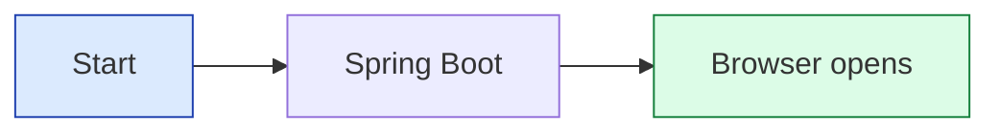

# Mermaid preview test

If this diagram renders as a **colored box with arrows**, your extension is working.
Open this file and press `Ctrl+Shift+V`.

If you see a **blank box**, try:

1. Confirm extension: **Markdown Preview Mermaid Support** by Matt Bierner
2. Close the preview tab, save this file, open preview again with `Ctrl+Shift+V`
3. Do not use "Markdown Preview Enhanced" unless that extension is installed instead
4. Push to GitHub and view this file there (Mermaid works without any extension)
